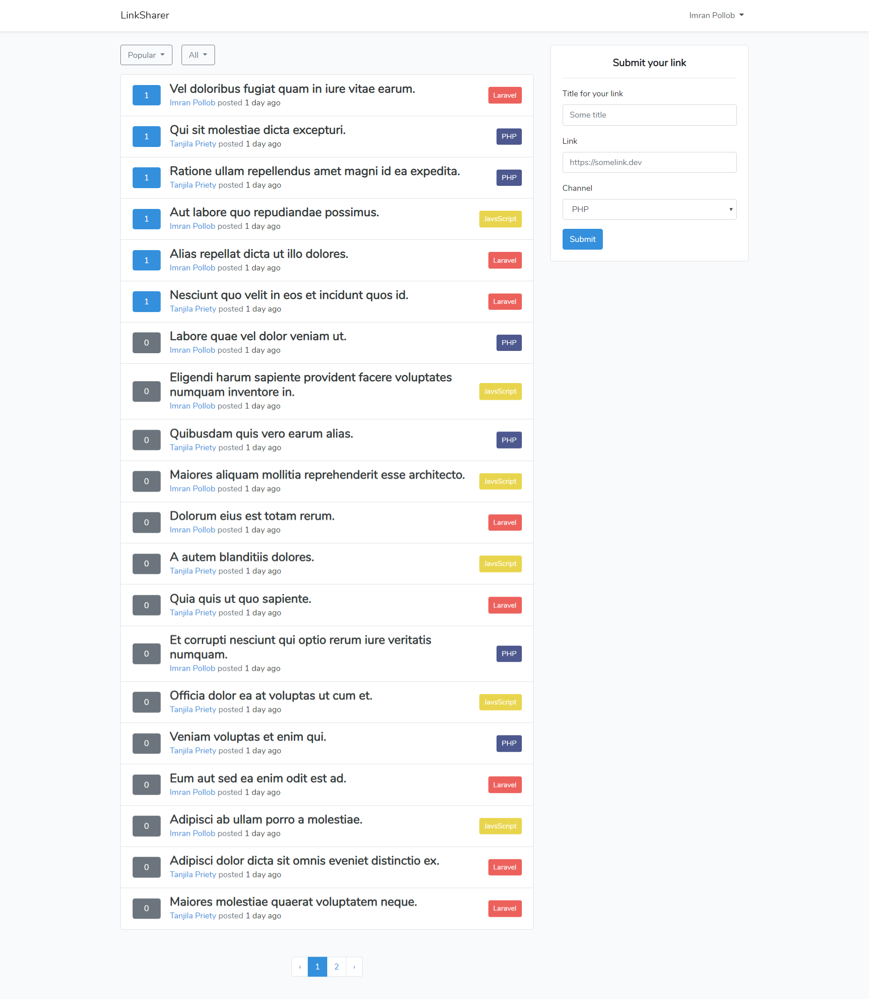

## Link Sharer

Features:
- User can post a link
- User can upvote a link
- Duplicate post gets popurality

#### Commands to run

Copy `.env.example` file content to `.env`

Then run the following commands

```shell
composer install
php artisan key:generate
php artisan migrate --seed
php artisan serve
```

### Screenshot

